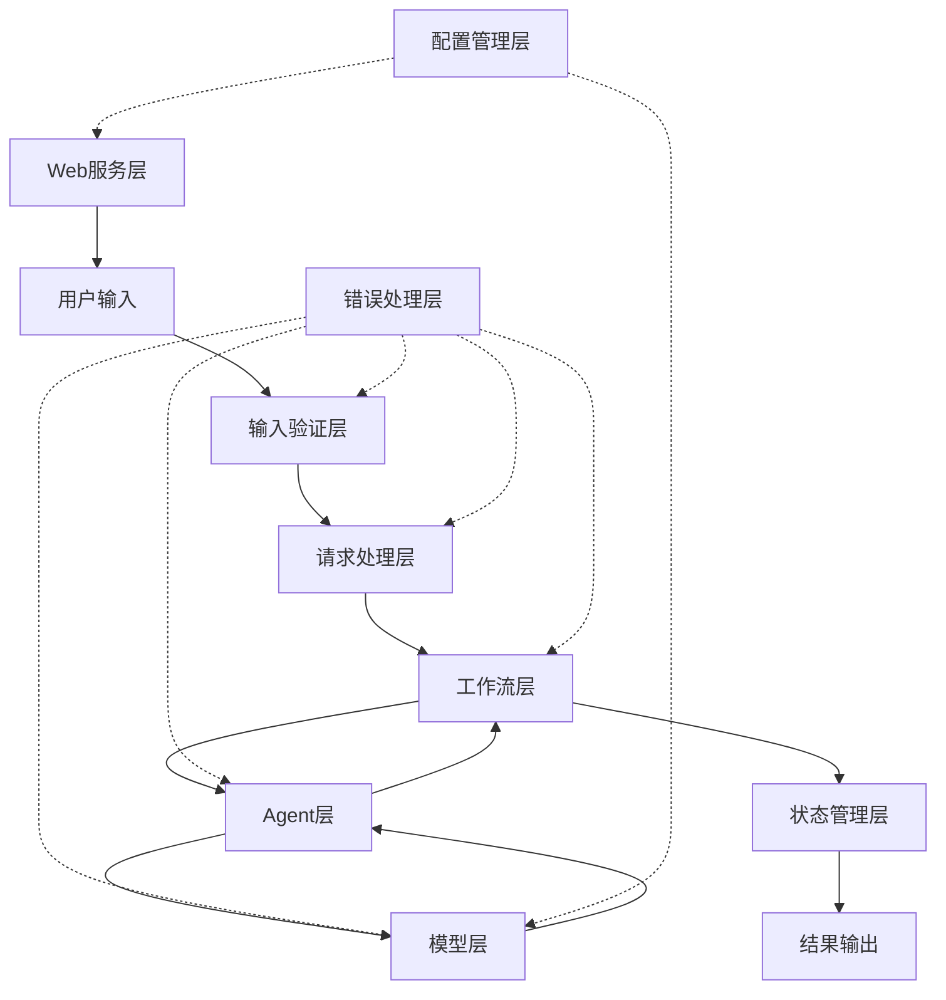

# 🏗️ Prompt优化器系统架构

## 📋 系统概述

Prompt优化器是一个基于多Agent协作的智能系统，使用LangGraph实现工作流编排，支持多种大语言模型。系统采用模块化设计，每个组件都有明确的职责和接口。最新版本增加了完整的Web界面、增强的错误处理和状态管理功能。

## 🎯 核心组件

### 1. 请求处理层 (Request Layer)
- **PromptRequest**: 请求数据结构
  - `role`: 目标用户角色
  - `basic_requirements`: 基本任务要求
  - `examples`: 可选的示例集合（支持字段名一致性验证）
  - `additional_requirements`: 可选的额外要求
  - `model_type`: 使用的模型类型

### 2. Agent层 (Agent Layer)
- **PromptGeneratorAgent**: 生成初始prompt和工程指导
  - 支持基于示例的prompt生成
  - 自动变量提取和验证
  - 多格式示例解析（JSON/文本）
- **PromptEvaluatorAgent**: 评估prompt质量和生成评估框架
  - 角色专项评估指标
  - 详细的质量分析报告
- **PromptImproverAgent**: 生成改进方案和优化建议
  - 3个不同维度的改进方案
  - 智能提取和解析逻辑

### 3. 工作流层 (Workflow Layer)
- **PromptOptimizerWorkflow**: 协调多个Agent的工作流程
  1. **生成工程指导** - 角色专项prompt工程指南
  2. **分析角色和要求** - 理解用户需求和场景
  3. **生成初始Prompt** - 基于角色和示例生成
  4. **创建评估框架** - 建立质量评估标准
  5. **执行Prompt评估** - 全面质量分析
  6. **生成改进方案** - 多维度优化建议
  7. **选择最佳版本** - 智能推荐最优方案

### 4. 模型层 (Model Layer)
- **ModelFactory**: 模型工厂类
  - 支持多种模型类型（Gemini/OpenAI）
  - 模型实例缓存机制
  - 自动代理配置管理
  - 统一的错误处理和重试机制

### 5. Web服务层 (Web Service Layer)
- **Web界面**: 基于Gradio的交互界面
  - 🚀 **Prompt优化页面**: 流式处理和实时反馈
  - 🔧 **手动验证页面**: 变量管理和验证
  - 📖 **使用说明页面**: 完整的文档和示例
- **A2A服务**: Agent-to-Agent标准接口
  - RESTful API设计
  - 标准化的请求/响应格式
  - 支持流式响应

### 6. 状态管理层 (State Management Layer) 🆕
- **SessionState**: 会话状态管理类
  - 用户会话隔离
  - 优化历史记录
  - 安全的状态更新
  - 内存管理和清理

### 7. 错误处理层 (Error Handling Layer) 🆕
- **分类错误处理**: 
  - `ValueError`: 输入验证错误
  - `ConnectionError`: 网络连接错误
  - `RuntimeError`: 运行时错误
- **优雅降级**: 单个步骤失败不影响整体流程
- **详细日志**: 完整的错误追踪和调试信息

### 8. 配置管理层 (Configuration Layer) 🆕
- **环境变量管理**: 丰富的配置选项
- **动态配置**: 支持运行时配置更新
- **配置验证**: 启动时自动检查配置完整性

## 🔄 工作流程



## 💡 关键设计决策

### 1. **模块化设计**
   - 每个Agent独立负责特定任务
   - 便于扩展和维护
   - 支持灵活的组件替换
   - 清晰的接口定义

### 2. **状态管理** 🆕
   - 使用SessionState类替代全局变量
   - 类型安全的状态更新
   - 支持状态追踪和恢复
   - 会话隔离和历史记录

### 3. **错误处理** 🆕
   - 多层级错误捕获和分类
   - 优雅的降级策略
   - 详细的错误日志和堆栈追踪
   - 用户友好的错误消息

### 4. **可扩展性**
   - 支持添加新的模型类型
   - 可扩展的Agent功能
   - 灵活的工作流定制
   - 插件化架构设计

### 5. **输入验证** 🆕
   - 全面的输入格式检查
   - 示例字段名一致性验证
   - API密钥和配置验证
   - 实时错误反馈

## 🔧 配置管理

### 环境变量（完整列表）
| 变量类别 | 变量名 | 默认值 | 说明 |
|----------|--------|--------|------|
| **API配置** | `GOOGLE_API_KEY` | - | Gemini API密钥 |
| | `OPENAI_API_KEY` | - | OpenAI API密钥 |
| **服务器配置** | `SERVER_HOST` | `0.0.0.0` | A2A服务器主机 |
| | `SERVER_PORT` | `9999` | A2A服务器端口 |
| | `WEB_HOST` | `0.0.0.0` | Web界面主机 |
| | `WEB_PORT` | `7860` | Web界面端口 |
| **日志配置** | `LOG_LEVEL` | `info` | 日志级别 |
| | `VERBOSE_LOGGING` | `false` | 详细日志 |
| | `LOG_FILE_PATH` | `prompt_optimizer.log` | 日志文件路径 |
| **运行配置** | `WORKERS` | `1` | 工作进程数 |
| | `RELOAD` | `false` | 热重载 |
| **模型配置** | `MODEL_TEMPERATURE` | `0.7` | 模型温度 |
| | `REQUEST_TIMEOUT` | `60` | 请求超时 |
| | `MAX_RETRIES` | `3` | 最大重试次数 |
| **代理配置** | `HTTPS_PROXY` | `http://127.0.0.1:7890` | HTTPS代理 |
| | `HTTP_PROXY` | `http://127.0.0.1:7890` | HTTP代理 |

### 缓存策略 🆕
- **模型实例缓存**: 按模型类型缓存，避免重复初始化
- **工作流状态缓存**: 支持断点续传和状态恢复
- **会话状态缓存**: 用户会话和历史记录管理
- **配置缓存**: 环境变量解析结果缓存

## 📈 性能考虑

### 1. **响应时间优化**
   - 模型实例缓存和复用
   - 异步并行处理
   - 流式响应和实时反馈
   - 智能错误恢复

### 2. **资源使用优化**
   - 内存管理和垃圾回收
   - API调用频率控制
   - 缓存大小限制
   - 连接池管理

### 3. **可靠性保障**
   - 错误重试机制
   - 超时处理和熔断
   - 状态恢复和持久化
   - 健康检查和监控

### 4. **用户体验优化** 🆕
   - 实时进度显示
   - 智能错误提示
   - 响应式界面设计
   - 多语言错误消息

## 🔒 安全性

### 1. **API密钥管理**
   - 环境变量安全存储
   - 密钥格式验证
   - 访问控制和权限管理
   - 密钥轮换支持

### 2. **输入验证** 🆕
   - 请求数据格式验证
   - SQL注入和XSS防护
   - 文件上传安全检查
   - 输入长度和类型限制

### 3. **错误处理安全** 🆕
   - 敏感信息脱敏
   - 错误消息标准化
   - 日志安全记录
   - 异常堆栈过滤

### 4. **网络安全**
   - HTTPS强制使用
   - 代理配置验证
   - 请求头安全检查
   - 跨域访问控制

## 🔄 数据流架构

### 1. **输入数据流**
```
用户输入 → 格式验证 → 示例解析 → 字段验证 → 状态创建
```

### 2. **处理数据流**
```
状态管理 → Agent处理 → 模型调用 → 结果生成 → 状态更新
```

### 3. **输出数据流**
```
结果格式化 → 错误检查 → 响应生成 → 用户反馈
```

### 4. **错误数据流** 🆕
```
异常捕获 → 错误分类 → 日志记录 → 用户提示 → 状态恢复
```

## 🔄 未来扩展

### 1. **新功能规划**
   - 更多模型支持（Claude、LLaMA等）
   - 高级优化策略（强化学习、遗传算法）
   - 自定义评估指标
   - 批处理和队列管理

### 2. **性能优化计划**
   - 分布式处理架构
   - 更智能的缓存策略
   - GPU加速支持
   - 流式计算优化

### 3. **集成增强方向**
   - 更多API集成（LangSmith、WandB）
   - 插件系统架构
   - 监控和分析平台
   - CI/CD集成支持

### 4. **用户体验改进** 🆕
   - 多语言界面支持
   - 自定义主题和布局
   - 离线功能支持
   - 移动端适配

## 📁 文件结构（更新版）

```
prompt_agent/
├── main.py                     # 主服务入口（A2A）
├── web.py                      # Web界面入口（Gradio）🆕
├── prompt_optimizer.py         # 多Agent工作流实现
├── prompt_optimizer_executor.py # A2A集成层
├── demo.py                     # 演示脚本
├── test_client.py              # A2A客户端测试
├── test_web.py                 # Web界面测试 🆕
├── test_proxy_optimization.py  # 代理和优化测试 🆕
├── config_example.env          # 配置示例（完整版）🆕
├── requirements.txt            # 依赖管理
├── README.md                   # 使用说明（更新版）
├── ARCHITECTURE.md             # 架构文档（本文档）
└── prompt_optimizer.log        # 日志文件 🆕
```

## 🚀 部署架构

### 本地开发部署
```
┌─────────────────┐    ┌─────────────────┐
│   Web界面       │    │   A2A服务       │
│  (Port 7860)    │    │  (Port 9999)    │
└─────────────────┘    └─────────────────┘
         │                       │
         └───────────┬───────────┘
                     │
         ┌─────────────────┐
         │  Prompt优化器    │
         │   核心引擎      │
         └─────────────────┘
                     │
         ┌─────────────────┐
         │   模型API       │
         │ Gemini/OpenAI   │
         └─────────────────┘
```

### 生产环境部署
```
┌─────────────────┐    ┌─────────────────┐
│   负载均衡器     │    │   监控系统      │
│   (Nginx)       │    │ (Prometheus)    │
└─────────────────┘    └─────────────────┘
         │                       │
┌─────────────────┐    ┌─────────────────┐
│  Web服务实例    │    │  A2A服务实例    │
│   (多个)        │    │   (多个)        │
└─────────────────┘    └─────────────────┘
         │                       │
         └───────────┬───────────┘
                     │
         ┌─────────────────┐
         │   Redis缓存     │
         │   状态存储      │
         └─────────────────┘
```

## 🔄 工作流优化架构

基于经典的prompt优化流程的技术实现：

### 传统流程 → 技术实现映射
1. **"Generate prompt engineering guide"** 
   → `PromptGeneratorAgent.generate_prompt_engineering_guide()`
   
2. **"Analyze examples and requirements"** 
   → `输入验证层` + `示例解析器`
   
3. **"Generate initial prompt"** 
   → `PromptGeneratorAgent.generate_prompt_from_examples()`
   
4. **"Create evaluation framework"** 
   → `PromptEvaluatorAgent.generate_evaluation_guide()`
   
5. **"Evaluate prompt quality"** 
   → `PromptEvaluatorAgent.evaluate_prompt()`
   
6. **"Generate improvements"** 
   → `PromptImproverAgent.generate_improved_prompts()`
   
7. **"Select best version"** 
   → `finalize_node()` + `状态管理`

### 技术创新点 🆕
- **自动字段验证**: 确保示例数据一致性
- **智能错误恢复**: 单步失败不影响整体流程
- **流式处理**: 实时反馈优化进度
- **会话管理**: 支持多用户并发和历史记录
- **配置驱动**: 所有参数可通过环境变量调整

这种架构设计充分利用了大模型的自我优化能力，同时通过工程化手段保证了系统的稳定性和可用性。

## 📊 性能指标

### 系统性能目标
- **响应时间**: < 30秒（完整优化流程）
- **并发支持**: 10+ 用户同时使用
- **可用性**: 99.9% 正常运行时间
- **错误率**: < 1% 系统错误
- **内存使用**: < 2GB（单实例）

### 监控指标
- API调用成功率和延迟
- 模型响应时间分布
- 系统资源使用情况
- 用户会话和错误统计
- 缓存命中率和效果 