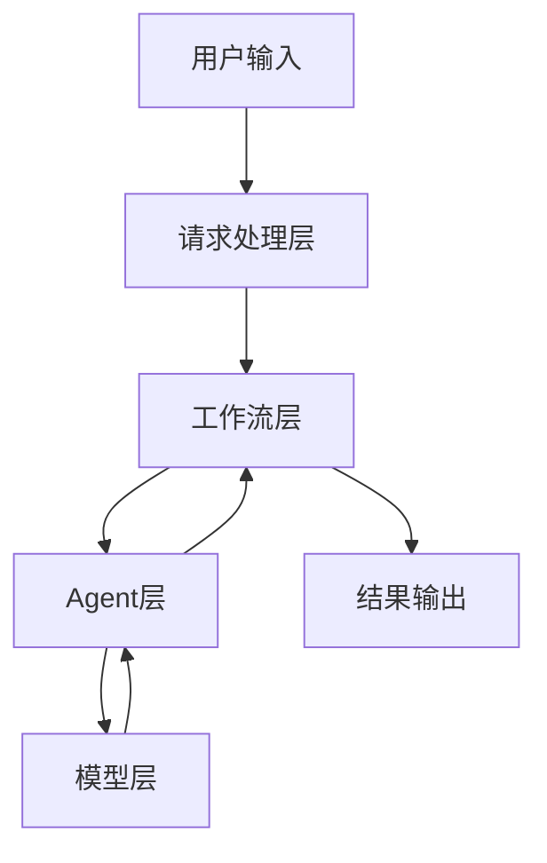

# 🏗️ Prompt优化器系统架构

## 📋 系统概述

Prompt优化器是一个基于多Agent协作的智能系统，使用LangGraph实现工作流编排，支持多种大语言模型。系统采用模块化设计，每个组件都有明确的职责和接口。

## 🎯 核心组件

### 1. 请求处理层 (Request Layer)
- **PromptRequest**: 请求数据结构
  - `role`: 目标用户角色
  - `basic_requirements`: 基本任务要求
  - `examples`: 可选的示例集合
  - `additional_requirements`: 可选的额外要求
  - `model_type`: 使用的模型类型

### 2. Agent层 (Agent Layer)
- **PromptGeneratorAgent**: 生成初始prompt和工程指导
- **PromptEvaluatorAgent**: 评估prompt质量和生成评估框架
- **PromptImproverAgent**: 生成改进方案和优化建议

### 3. 工作流层 (Workflow Layer)
- **PromptOptimizerWorkflow**: 协调多个Agent的工作流程
  1. 生成工程指导
  2. 分析角色和要求
  3. 生成初始prompt
  4. 创建评估框架
  5. 执行prompt评估
  6. 生成改进方案
  7. 选择最佳版本

### 4. 模型层 (Model Layer)
- **ModelFactory**: 模型工厂类
  - 支持多种模型类型
  - 处理模型实例缓存
  - 管理代理配置

### 5. Web服务层 (Web Service Layer)
- **Web界面**: 基于Gradio的交互界面
- **A2A服务**: Agent-to-Agent标准接口

## 🔄 工作流程



## 💡 关键设计决策

1. **模块化设计**
   - 每个Agent独立负责特定任务
   - 便于扩展和维护
   - 支持灵活的组件替换

2. **状态管理**
   - 使用TypedDict管理状态
   - 确保类型安全
   - 支持状态追踪和恢复

3. **错误处理**
   - 多层级错误捕获
   - 优雅的降级策略
   - 详细的错误日志

4. **可扩展性**
   - 支持添加新的模型类型
   - 可扩展的Agent功能
   - 灵活的工作流定制

## 🔧 配置管理

### 环境变量
- `GOOGLE_API_KEY`: Gemini API密钥
- `OPENAI_API_KEY`: OpenAI API密钥
- `HTTPS_PROXY`: HTTPS代理设置
- `HTTP_PROXY`: HTTP代理设置

### 缓存策略
- 模型实例缓存
- 工作流状态缓存
- 结果缓存

## 📈 性能考虑

1. **响应时间优化**
   - 模型实例缓存
   - 并行处理
   - 流式响应

2. **资源使用**
   - 内存管理
   - API调用优化
   - 缓存清理

3. **可靠性**
   - 错误重试机制
   - 超时处理
   - 状态恢复

## 🔒 安全性

1. **API密钥管理**
   - 环境变量配置
   - 密钥验证
   - 访问控制

2. **输入验证**
   - 请求数据验证
   - 类型检查
   - 安全过滤

3. **错误处理**
   - 安全的错误消息
   - 日志脱敏
   - 异常隔离

## 🔄 未来扩展

1. **新功能**
   - 更多模型支持
   - 高级优化策略
   - 自定义评估指标

2. **性能优化**
   - 分布式处理
   - 更智能的缓存
   - 批处理支持

3. **集成增强**
   - 更多API集成
   - 插件系统
   - 监控和分析

## 📁 文件结构

```
prompt_agent/
├── main.py                     # 主服务入口
├── prompt_optimizer.py         # 多Agent工作流实现
├── prompt_optimizer_executor.py # A2A集成层
├── setup_and_run.py           # 快速启动脚本
├── demo.py                     # 演示脚本
├── test_prompt_optimizer.py    # 测试客户端
├── config_example.env          # 配置示例
├── requirements.txt            # 依赖管理
├── README.md                   # 使用说明
└── ARCHITECTURE.md             # 架构文档
```

## 🚀 部署和扩展

### 水平扩展
- 每个Agent可独立扩展
- 支持分布式部署
- 状态持久化支持

### 性能优化
- 异步处理提升吞吐量
- 缓存机制减少重复计算
- 并行执行Compatible的操作

### 监控和观测
- LangSmith集成支持
- 详细的执行日志
- 性能指标收集

## 🔄 工作流优化思路

您描述的优化流程完美地映射到了我们的多Agent架构：

1. **"Generate a detailed prompt engineering guide"** → `PromptGeneratorAgent.generate_prompt_engineering_guide()`
2. **"Paste in 5 examples"** → 通过输入参数提供
3. **"Generate a prompt that could have generated the examples' outputs"** → `PromptGeneratorAgent.generate_prompt_from_examples()`
4. **"Generate a detailed prompt evaluation guide"** → `PromptEvaluatorAgent.generate_evaluation_guide()`
5. **"Evaluate the prompt"** → `PromptEvaluatorAgent.evaluate_prompt()`
6. **"Generate 3 improved alternative prompts"** → `PromptImproverAgent.generate_improved_prompts()`
7. **"Pick the best one, and edit as necessary"** → `finalize_node()` + 用户选择

这种设计充分利用了"LLM's own weights influence how the prompt is generated and evaluated"的优势，每个Agent都使用同一模型家族，确保一致性和最佳效果。 